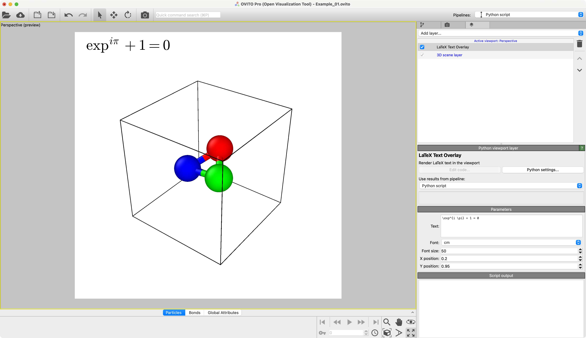

# LaTeX Text Overlay
Render LaTeX text in the viewport

## Description
Add LaTeX text labels to your OVITO Pro renders. Rendering is based on matplotlib's text labels.

## Parameters 

| GUI name       | Python name  | Description                                                                                                                                 | Default Value                            |
|----------------|--------------|---------------------------------------------------------------------------------------------------------------------------------------------|------------------------------------------|
| **Text**       | `text`       | Text to be rendered in LaTeX.                                                                                                               | `"\exp^{i \pi} + 1 = 0"`                 |
| **Font**       | `font`       | Font of the text. The list of available fonts is platform dependent / matplotlib version dependent.                                         | The (alphabetically) first font is used. |
| **Font size**  | `font_size`  | Font size of the text.                                                                                                                      | `50`                                     |
| **Text color** | `text_color` | Color of the text.                                                                                                                          | `(0.0, 0.0, 0.0)`                        |
| **X position** | `px`         | X position of the text given in relative coordinates, where `0.0` corresponds to the left edge of the viewport and `1.0` to the right edge. | `0.5`                                    |
| **Y position** | `py`         | Y position of the text given in relative coordinates, where 0.0 corresponds to the bottom edge of the viewport and 1.0 to the top edge.     | `0.5`                                    |

## Example


## Installation
- OVITO Pro [integrated Python interpreter](https://docs.ovito.org/python/introduction/installation.html#ovito-pro-integrated-interpreter):
  ```
  ovitos -m pip install --user git+https://github.com/nnn911/LaTeXTextOverlay.git
  ``` 
  The `--user` option is recommended and [installs the package in the user's site directory](https://pip.pypa.io/en/stable/user_guide/#user-installs).

- Other Python interpreters or Conda environments:
  ```
  pip install git+https://github.com/nnn911/LaTeXTextOverlay.git
  ```

## Technical information / dependencies
- Tested on OVITO version 3.10.2

## Contact
Daniel Utt utt@ovito.org
